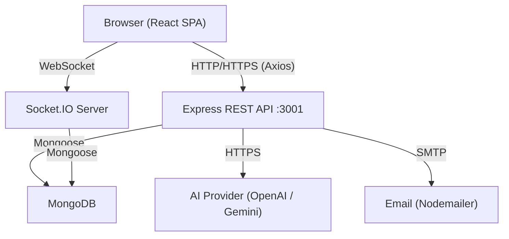

# Design Document: EthioTech Hub

## Overview

EthioTech Hub is a full-stack, AI-powered learning and freelance platform for Ethiopian technology students. The system is built as a monorepo with a React (Vite) single-page application on the frontend and a Node.js/Express REST API with Socket.IO on the backend, backed by MongoDB via Mongoose.

The platform serves two roles — **Student** and **Admin** — and integrates eight major subsystems: authentication, course learning, quiz/assessment, AI assistant, real-time chat, project submission/review, freelance marketplace, and portfolio/certificate management. All subsystems share a common notification layer and a leaderboard service.

### Key Design Goals

- **Security-first**: JWT + refresh-token rotation, bcrypt password hashing, rate limiting, XSS sanitization, CORS restriction, and role-based access control on every route.
- **Real-time**: Socket.IO for chat messaging and live notification delivery.
- **Extensible AI layer**: Provider-agnostic AI service switchable between OpenAI and Google Gemini via environment variable.
- **Ethiopian localization**: Full Amharic translation, Ethiopian-inspired visual theme, and Ethiopian Tech News section.
- **Testability**: Property-based tests (fast-check on backend, Vitest on frontend) for all core business-logic invariants.

---

## Architecture

The system follows a **layered monorepo architecture**:

```
ethiotech-hub/
├── frontend/          # React 18 + Vite SPA
│   └── src/
│       ├── pages/     # Route-level page components
│       ├── components/# Reusable UI components
│       ├── services/  # Axios API client wrappers
│       ├── hooks/     # Custom React hooks
│       ├── context/   # Auth, i18n, notification contexts
│       └── i18n/      # en.json, am.json translation files
└── backend/           # Node.js / Express REST API
    └── src/
        ├── models/    # Mongoose schemas
        ├── routes/    # Express routers
        ├── controllers/
        ├── services/  # Business logic (auth, leaderboard, cert, AI, notification)
        ├── middleware/ # JWT auth, role guard, rate limit, validation, error handler
        ├── socket/    # Socket.IO event handlers
        └── config/    # DB connection, environment config
```

### Communication Patterns



### Request Lifecycle

1. Browser sends HTTP request with `Authorization: Bearer <JWT>` header.
2. `authMiddleware` verifies the JWT signature and expiry; attaches `req.user`.
3. `roleGuard(role)` checks `req.user.role` against the required role; returns 403 if insufficient.
4. Joi validation middleware validates `req.body` against the route schema; returns 400 with field-level errors on failure.
5. Controller delegates to the appropriate service layer.
6. Service interacts with Mongoose models and, where needed, calls `notificationService.create()` or `leaderboardService.recalculate()`.
7. Response is returned; global `errorHandler` middleware catches any unhandled errors.

---

## Components and Interfaces

### Backend Route Map

| Method | Path | Auth | Role | Description |
|--------|------|------|------|-------------|
| POST | /api/auth/register | No | — | Register new student |
| POST | /api/auth/login | No | — | Login, receive JWT + refresh token |
| POST | /api/auth/refresh | No | — | Rotate refresh token, receive new JWT |
| POST | /api/auth/forgot-password | No | — | Request password reset email |
| POST | /api/auth/reset-password | No | — | Submit new password with reset token |
| GET | /api/courses | Yes | student | Paginated course catalog |
| GET | /api/courses/:id | Yes | student | Course detail |
| GET | /api/courses/:id/lessons | Yes | student | Ordered lesson list |
| POST | /api/courses/:id/enroll | Yes | student | Enroll in course |
| GET | /api/lessons/:id | Yes | student | Single lesson (enforces sequential order) |
| POST | /api/lessons/:id/complete | Yes | student | Mark lesson complete, update progress |
| GET | /api/quizzes/:courseId | Yes | student | Fetch quiz questions |
| POST | /api/quizzes/:id/submit | Yes | student | Grade and record quiz attempt |
| GET | /api/quizzes/history | Yes | student | Student's attempt history |
| GET | /api/leaderboard | Yes | student | Top 100 + requesting student's rank |
| POST | /api/ai/chat | Yes | student | Send message to AI assistant |
| GET | /api/ai/history/:sessionId | Yes | student | Retrieve conversation history |
| POST | /api/projects | Yes | student | Submit project |
| GET | /api/projects/mine | Yes | student | Student's submission history |
| PATCH | /api/projects/:id/review | Yes | admin | Approve/reject project with comment |
| GET | /api/chat/groups | Yes | student | List public groups |
| GET | /api/chat/groups/:id/messages | Yes | student | Last 50 messages for a group |
| POST | /api/chat/rooms | Yes | student | Create private team room |
| GET | /api/marketplace/jobs | Yes | student | Paginated job listings |
| POST | /api/marketplace/jobs | Yes | student | Post a job |
| POST | /api/marketplace/jobs/:id/apply | Yes | student | Apply for a job |
| PATCH | /api/marketplace/jobs/:id/accept/:appId | Yes | student | Accept applicant |
| PATCH | /api/marketplace/jobs/:id/complete | Yes | student | Mark job complete |
| POST | /api/marketplace/jobs/:id/review | Yes | student | Submit client review |
| GET | /api/portfolio/:studentId | No | — | Public portfolio |
| PATCH | /api/portfolio | Yes | student | Update skills / GitHub link / project order |
| GET | /api/notifications | Yes | student | Paginated notification list |
| PATCH | /api/notifications/:id/read | Yes | student | Mark notification read |
| PATCH | /api/notifications/read-all | Yes | student | Mark all notifications read |
| GET | /api/certificates/:verificationCode | No | — | Public certificate verification |
| GET | /api/certificates/mine | Yes | student | Student's certificates |
| GET | /api/certificates/:id/pdf | Yes | student | Download certificate PDF |
| GET | /api/dashboard/stats | Yes | student | Aggregated dashboard stats |
| GET | /api/admin/stats | Yes | admin | Platform-wide stats |
| POST | /api/admin/courses | Yes | admin | Create course |
| PATCH | /api/admin/courses/:id | Yes | admin | Update course |
| DELETE | /api/admin/courses/:id | Yes | admin | Delete course |
| GET | /api/admin/users | Yes | admin | Paginated user list |
| PATCH | /api/admin/users/:id/deactivate | Yes | admin | Deactivate user, revoke JWTs |
| PATCH | /api/admin/users/:id/promote | Yes | admin | Promote student to admin |
| DELETE | /api/admin/jobs/:id | Yes | admin | Remove job, notify applicants |

### Socket.IO Events

| Event (client → server) | Payload | Description |
|--------------------------|---------|-------------|
| `join_group` | `{ groupId }` | Subscribe to a public group room |
| `leave_group` | `{ groupId }` | Unsubscribe from a public group room |
| `send_message` | `{ groupId, content }` | Broadcast message to group |
| `join_room` | `{ roomId }` | Join private team room (access-checked) |
| `send_dm` | `{ roomId, content }` | Send message to private room |

| Event (server → client) | Payload | Description |
|--------------------------|---------|-------------|
| `new_message` | `{ message }` | New message in a group/room |
| `notification` | `{ notification }` | Real-time notification delivery |
| `error` | `{ message }` | Access denied or server error |

### Frontend Page Components

| Route | Component | Description |
|-------|-----------|-------------|
| `/` | `HomePage` | Landing page with Ethiopian Tech News |
| `/login` | `LoginPage` | Login form |
| `/register` | `RegisterPage` | Registration form |
| `/dashboard` | `StudentDashboard` | Progress charts, activity feed, stats |
| `/courses` | `CourseCatalog` | Filterable, paginated course list |
| `/courses/:id` | `CourseDetail` | Course info, lesson list, enroll button |
| `/courses/:id/lessons/:lessonId` | `LessonViewer` | Video, notes, code editor |
| `/courses/:id/quiz` | `QuizRunner` | Timed quiz with auto-submit |
| `/leaderboard` | `LeaderboardPage` | Ranked table with own rank highlight |
| `/ai` | `AIChatPanel` | AI assistant chat interface |
| `/projects` | `ProjectsPage` | Submit form + submission history |
| `/chat` | `ChatPage` | Group list sidebar + chat room |
| `/marketplace` | `JobBoard` | Filterable job listings |
| `/marketplace/:id` | `JobDetail` | Job detail + application form |
| `/portfolio/:studentId` | `PortfolioPage` | Public portfolio |
| `/portfolio/edit` | `PortfolioEditor` | Edit skills, GitHub, project order |
| `/certificates/:verificationCode` | `CertificateVerify` | Public certificate verification |
| `/admin` | `AdminDashboard` | Stats cards |
| `/admin/users` | `UserManager` | User table with deactivate/promote |
| `/admin/courses` | `CourseEditor` | Course + lesson CRUD |
| `/admin/projects` | `ProjectReview` | Approve/reject submissions |

---

## Data Models

### User

```js
{
  _id: ObjectId,
  email: { type: String, unique: true, required: true, lowercase: true },
  displayName: { type: String, required: true },
  passwordHash: { type: String, required: true },
  role: { type: String, enum: ['student', 'admin'], default: 'student' },
  portfolioSlug: { type: String, unique: true },  // generated from displayName + nanoid
  skills: [String],
  githubLink: String,
  isActive: { type: Boolean, default: true },
  refreshToken: String,           // hashed; null after rotation
  resetToken: String,             // hashed
  resetTokenExpiry: Date,
  averageFreelanceRating: { type: Number, default: 0 },
  projectOrder: [ObjectId],       // ordered list of approved project IDs
  createdAt: Date,
  updatedAt: Date
}
```

### Course

```js
{
  _id: ObjectId,
  title: { type: String, required: true },
  description: { type: String, required: true },
  category: { type: String, enum: ['Web Development','Mobile Development','AI/ML','Cybersecurity','UI/UX Design','Database Systems'], required: true },
  instructorName: String,
  enrollmentCount: { type: Number, default: 0 },
  isPublished: { type: Boolean, default: false },
  createdAt: Date,
  updatedAt: Date
}
```

### Lesson

```js
{
  _id: ObjectId,
  courseId: { type: ObjectId, ref: 'Course', required: true },
  title: { type: String, required: true },
  order: { type: Number, required: true },   // sequential, 1-based
  videoUrl: String,
  notes: String,
  hasCodingTask: { type: Boolean, default: false },
  codingTaskDescription: String,
  createdAt: Date
}
```

### Enrollment

```js
{
  _id: ObjectId,
  studentId: { type: ObjectId, ref: 'User', required: true },
  courseId: { type: ObjectId, ref: 'Course', required: true },
  progressPercent: { type: Number, default: 0, min: 0, max: 100 },
  completedLessons: [{ type: ObjectId, ref: 'Lesson' }],
  certificateIssued: { type: Boolean, default: false },
  enrolledAt: Date,
  // Compound unique index: { studentId: 1, courseId: 1 }
}
```

### Quiz

```js
{
  _id: ObjectId,
  courseId: { type: ObjectId, ref: 'Course', required: true },
  title: String,
  durationSeconds: { type: Number, required: true },
  isFinal: { type: Boolean, default: false },
  questions: [{
    text: String,
    type: { type: String, enum: ['multiple-choice', 'coding'] },
    options: [String],          // for multiple-choice
    correctIndex: Number,       // for multiple-choice
    testCases: [{               // for coding
      input: String,
      expectedOutput: String
    }]
  }]
}
```

### QuizAttempt

```js
{
  _id: ObjectId,
  studentId: { type: ObjectId, ref: 'User', required: true },
  quizId: { type: ObjectId, ref: 'Quiz', required: true },
  score: Number,                // percentage 0-100
  timeTakenSeconds: Number,
  answers: [Mixed],
  submittedAt: Date
}
```

### AISession

```js
{
  _id: ObjectId,
  studentId: { type: ObjectId, ref: 'User', required: true },
  messages: [{
    role: { type: String, enum: ['user', 'assistant'] },
    content: String,
    timestamp: Date
  }],
  createdAt: Date,
  updatedAt: Date
}
```

### Project

```js
{
  _id: ObjectId,
  studentId: { type: ObjectId, ref: 'User', required: true },
  title: { type: String, required: true },
  description: { type: String, required: true },
  githubUrl: String,
  liveDemoUrl: String,
  status: { type: String, enum: ['pending','approved','rejected'], default: 'pending' },
  adminComment: String,
  rating: { type: Number, min: 1, max: 5 },
  submittedAt: Date,
  reviewedAt: Date
}
```

### ChatGroup

```js
{
  _id: ObjectId,
  name: { type: String, required: true },
  isPublic: { type: Boolean, default: true },
  members: [{ type: ObjectId, ref: 'User' }],  // populated for private rooms
  createdAt: Date
}
```

### ChatMessage

```js
{
  _id: ObjectId,
  groupId: { type: ObjectId, ref: 'ChatGroup', required: true },
  senderId: { type: ObjectId, ref: 'User', required: true },
  content: { type: String, required: true },
  threadParentId: ObjectId,   // null for top-level; set for thread replies
  createdAt: Date
  // Index: { groupId: 1, createdAt: -1 }
}
```

### Job

```js
{
  _id: ObjectId,
  clientId: { type: ObjectId, ref: 'User', required: true },
  title: { type: String, required: true },
  description: { type: String, required: true },
  requiredSkills: [String],
  budgetMin: Number,
  budgetMax: Number,
  category: { type: String, enum: ['Web Design','Frontend Development','Backend Development','Mobile Development','AI Integration'] },
  status: { type: String, enum: ['open','in progress','completed','removed'], default: 'open' },
  acceptedApplicantId: ObjectId,
  clientConfirmedComplete: { type: Boolean, default: false },
  studentConfirmedComplete: { type: Boolean, default: false },
  createdAt: Date
}
```

### JobApplication

```js
{
  _id: ObjectId,
  jobId: { type: ObjectId, ref: 'Job', required: true },
  studentId: { type: ObjectId, ref: 'User', required: true },
  appliedAt: Date
}
```

### FreelanceReview

```js
{
  _id: ObjectId,
  jobId: { type: ObjectId, ref: 'Job', required: true },
  studentId: { type: ObjectId, ref: 'User', required: true },
  clientId: { type: ObjectId, ref: 'User', required: true },
  rating: { type: Number, min: 1, max: 5, required: true },
  reviewText: String,
  createdAt: Date
}
```

### Notification

```js
{
  _id: ObjectId,
  recipientId: { type: ObjectId, ref: 'User', required: true },
  type: { type: String, enum: ['project_status','job_match','application_status','course_update','new_message','certificate_issued'], required: true },
  payload: Mixed,   // event-specific data (projectId, jobId, comment, etc.)
  isRead: { type: Boolean, default: false },
  createdAt: Date
  // Index: { recipientId: 1, createdAt: -1 }
}
```

### Certificate

```js
{
  _id: ObjectId,
  studentId: { type: ObjectId, ref: 'User', required: true },
  courseId: { type: ObjectId, ref: 'Course', required: true },
  studentName: String,
  courseTitle: String,
  completionDate: Date,
  verificationCode: { type: String, unique: true },  // UUID v4
  createdAt: Date
}
```

### Leaderboard

```js
{
  _id: ObjectId,
  studentId: { type: ObjectId, ref: 'User', required: true, unique: true },
  displayName: String,
  compositeScore: Number,   // 0.4*norm(courses) + 0.4*norm(testScore) + 0.2*norm(projects)
  rank: Number,
  completedCourses: Number,
  highestTestScore: Number,
  approvedProjects: Number,
  updatedAt: Date
}
```

---

## Correctness Properties

*A property is a characteristic or behavior that should hold true across all valid executions of a system — essentially, a formal statement about what the system should do. Properties serve as the bridge between human-readable specifications and machine-verifiable correctness guarantees.*

### Property 1: Password Hashing Round-Trip

*For any* valid plaintext password, the stored hash must not equal the plaintext, and `bcrypt.compare(plaintext, hash)` must return `true`.

**Validates: Requirements 1.2, 16.4**

---

### Property 2: Duplicate Email Registration Returns 409 and Leaves Collection Unchanged

*For any* email address already associated with a registered user, a subsequent registration attempt with that same email — regardless of the display name or password provided — must return a 409 Conflict response, and the total number of user documents in the collection must remain unchanged.

**Validates: Requirements 1.3**

---

### Property 3: Refresh Token Rotation Invalidates Previous Token

*For any* valid refresh token issued to a user, using that token once to obtain a new JWT must invalidate the original refresh token such that a second use of the same token returns an error.

**Validates: Requirements 1.8**

---

### Property 4: Role-Based Access Invariant

*For any* user with the "student" role and a valid JWT, every request to an admin-designated route must return a 403 Forbidden response; and *for any* user with the "admin" role and a valid JWT, requests to both admin-designated and student-designated routes must not return 403.

**Validates: Requirements 3.1, 3.2**

---

### Property 5: Enrollment Progress is Monotonically Non-Decreasing

*For any* enrollment and any arbitrary sequence of distinct lesson completions within that course, the `progressPercent` value after each completion must be greater than or equal to the value before that completion, and must equal `(completedLessons.length / totalLessons) * 100` after each step.

**Validates: Requirements 5.3, 5.5**

---

### Property 6: Certificate Issued for All Qualifying Enrollments

*For any* enrollment where all lessons in the course are marked complete and the final quiz score is greater than or equal to 70%, a corresponding Certificate record must exist in the database with the correct `studentId`, `courseId`, and a non-empty `verificationCode`.

**Validates: Requirements 5.6, 18.1**

---

### Property 7: All Verification Codes Are Distinct

*For any* set of N certificates generated by the system, all `verificationCode` values must be pairwise distinct strings.

**Validates: Requirements 18.1**

---

### Property 8: Leaderboard Composite Score Formula Invariant

*For any* student metrics tuple `(completedCourses, highestTestScore, approvedProjects)`, the `compositeScore` computed by `leaderboardService.recalculate()` must equal `0.4 * norm(completedCourses) + 0.4 * norm(highestTestScore) + 0.2 * norm(approvedProjects)` within floating-point tolerance (epsilon = 1e-9), where `norm(x)` normalizes the value to the [0, 1] range relative to the current maximum across all students.

**Validates: Requirements 17.1**

---

### Property 9: Project Status Transition Always Creates a Notification

*For any* project submission whose status transitions from "pending" to either "approved" or "rejected", a Notification record must be created with `recipientId` equal to the submitting student's ID, `type` equal to `"project_status"`, and a `payload` containing the new status and any admin comment.

**Validates: Requirements 9.4**

---

### Property 10: Non-Member Access to Private Room Returns 403

*For any* private team room and *for any* user who is not in that room's `members` list, any attempt to join or send a message to that room via Socket.IO must result in an `error` event with a 403-equivalent message being emitted back to that socket, and no message must be persisted or broadcast.

**Validates: Requirements 10.6**

---

### Property 11: Malformed Request Body Returns 400 with Field-Level Details and No DB Write

*For any* API endpoint that accepts a request body, and *for any* request body that is missing a required field or contains a value of the wrong type, the response must be 400 Bad Request with a body containing field-level error details, and no document must be written to the database as a result of that request.

**Validates: Requirements 16.1**

---

### Property 12: Rate Limiting Returns 429 After Threshold

*For any* IP address, after 10 requests to any `/api/auth/*` endpoint within a 60-second window, all subsequent requests from that IP within the same window must receive a 429 Too Many Requests response.

**Validates: Requirements 16.3**

---

## Error Handling

### HTTP Error Conventions

| Status | Condition |
|--------|-----------|
| 400 | Validation failure — field-level details in `errors` array |
| 401 | Missing or invalid JWT |
| 403 | Insufficient role or private room access denied |
| 404 | Resource not found |
| 409 | Duplicate enrollment, duplicate email registration |
| 429 | Rate limit exceeded on auth routes |
| 503 | AI provider upstream error |

### Global Error Handler

The `errorHandler` middleware in `backend/src/middleware/errorHandler.js` catches all errors thrown or passed via `next(err)`. It maps Mongoose `ValidationError` and `CastError` to 400, `MongoServerError` code 11000 (duplicate key) to 409, and JWT errors to 401. All unrecognized errors return 500 with a generic message; the full stack trace is logged internally and never exposed to the client.

### AI Provider Errors

`aiService.js` wraps all provider calls in a try/catch with a 10-second `AbortController` timeout. On timeout or upstream error, it logs the failure with the provider name, error code, and timestamp, then throws a typed `AIProviderError` that the controller maps to a 503 response with a user-friendly message.

### Socket.IO Errors

The `chatHandler` emits an `error` event back to the originating socket for access-denied conditions (non-member joining a private room) and for malformed payloads. It never broadcasts errors to other room members.

### Frontend Error Handling

Axios interceptors in `frontend/src/services/api.js` handle:
- **401 responses**: Clear local auth state and redirect to `/login`.
- **429 responses**: Display a rate-limit toast notification.
- **503 responses**: Display an AI-unavailable message in the chat panel.
- **Network errors**: Display a generic connectivity error toast.

---

## Testing Strategy

### Dual Testing Approach

The project uses a **dual testing approach**: property-based tests for universal invariants and example-based unit/integration tests for specific behaviors and edge cases.

### Backend: Jest + fast-check

All backend tests live in `backend/tests/`. The test runner is Jest with `--runInBand` to avoid parallel MongoDB connection issues. `mongodb-memory-server` provides an in-memory MongoDB instance for all tests.

**Property-Based Tests** (fast-check, minimum 100 iterations each):

Each property test is tagged with a comment in the format:
`// Feature: ethiotech-hub, Property N: <property_text>`

| Test File | Property | fast-check Arbitraries |
|-----------|----------|------------------------|
| `auth.pbt.test.js` | Property 1: Password hashing round-trip | `fc.string({ minLength: 8 })` for passwords |
| `auth.pbt.test.js` | Property 2: Duplicate email returns 409 | `fc.emailAddress()` for emails |
| `auth.pbt.test.js` | Property 3: Refresh token rotation | `fc.record({ email, password })` |
| `auth.pbt.test.js` | Property 4: Role-based access invariant | `fc.constantFrom('student', 'admin')` for roles |
| `enrollment.pbt.test.js` | Property 5: Progress monotonically non-decreasing | `fc.array(fc.nat())` for lesson completion sequences |
| `certificate.pbt.test.js` | Property 6: Certificate issued for qualifying enrollments | `fc.float({ min: 70, max: 100 })` for quiz scores |
| `certificate.pbt.test.js` | Property 7: All verification codes are distinct | `fc.integer({ min: 2, max: 50 })` for N certificates |
| `leaderboard.pbt.test.js` | Property 8: Composite score formula invariant | `fc.tuple(fc.nat(), fc.float({ min: 0, max: 100 }), fc.nat())` |
| `project.pbt.test.js` | Property 9: Status transition creates notification | `fc.constantFrom('approved', 'rejected')` for new status |
| `chat.pbt.test.js` | Property 10: Non-member access returns 403 | `fc.array(fc.uuid())` for member lists |
| `validation.pbt.test.js` | Property 11: Malformed body returns 400, no DB write | `fc.record(...)` with missing/wrong-type fields |
| `auth.pbt.test.js` | Property 12: Rate limiting returns 429 | `fc.integer({ min: 11, max: 20 })` for request counts |

**Example-Based Unit Tests**:
- Auth flow: register → login → protected route → refresh token
- Password reset: request → email → submit new password → login with new password
- Course enrollment: enroll → complete lessons → quiz → certificate issuance
- Admin promotion: admin promotes student → student can access admin routes
- AI session: send message → verify response persisted → retrieve history

**Integration Tests** (Task 17):
- Full auth flow end-to-end with supertest
- Course enrollment and progress tracking end-to-end
- Project submission → admin review → notification delivery
- Job posting → application → acceptance → completion → review
- Certificate issuance on course completion
- Socket.IO group messaging with `socket.io-client`

### Frontend: Vitest + React Testing Library

All frontend tests live in `frontend/src/tests/`. Vitest is configured with jsdom.

**Component Tests**:
- `AuthForms.test.jsx`: Form validation, submission, error display
- `CourseCatalog.test.jsx`: Filter/sort controls, pagination, enrollment button
- `QuizRunner.test.jsx`: Timer countdown, auto-submit on expiry, answer selection
- `NotificationBell.test.jsx`: Unread count badge, mark-as-read interaction
- `PortfolioPage.test.jsx`: Public portfolio rendering with all required sections
- `LeaderboardPage.test.jsx`: Rank table rendering, own-rank highlight

**Property-Based Tests** (Vitest + fast-check):
- `validation.pbt.test.jsx` — Property 11 (frontend): *For any* form submission with missing required fields, the form must display field-level error messages and not call the API.

### Test Configuration

```js
// backend/jest.config.js — already configured
// frontend/vite.config.js — vitest configured with jsdom environment
// Minimum 100 iterations per property test:
fc.assert(fc.property(...), { numRuns: 100 })
```
